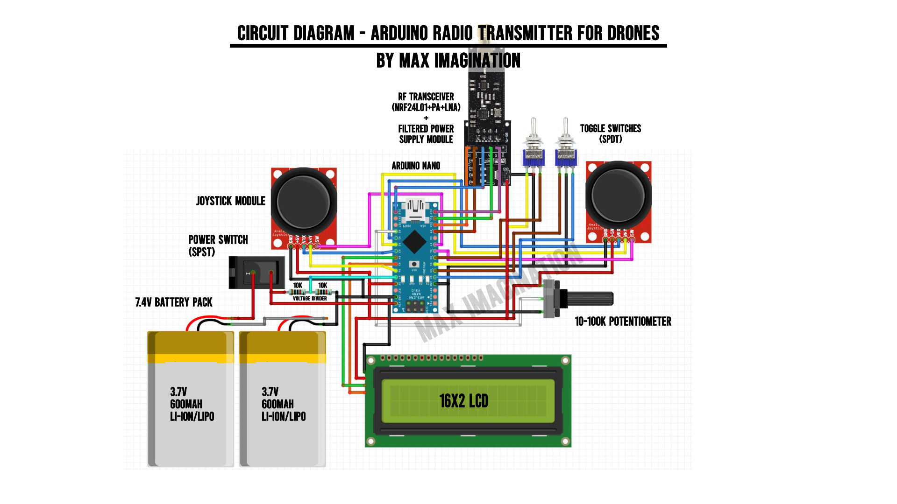
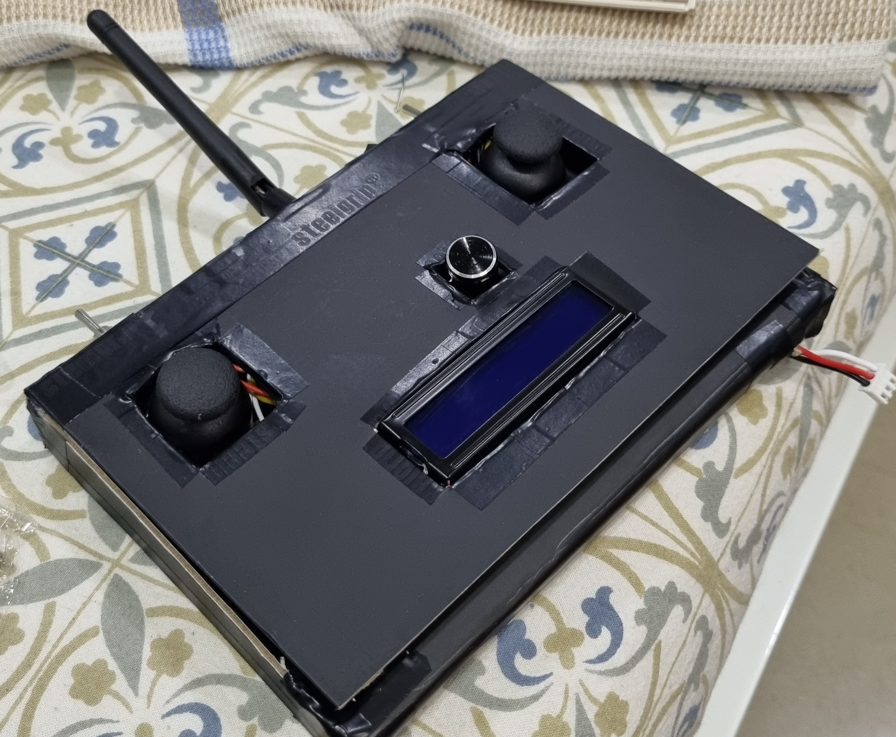
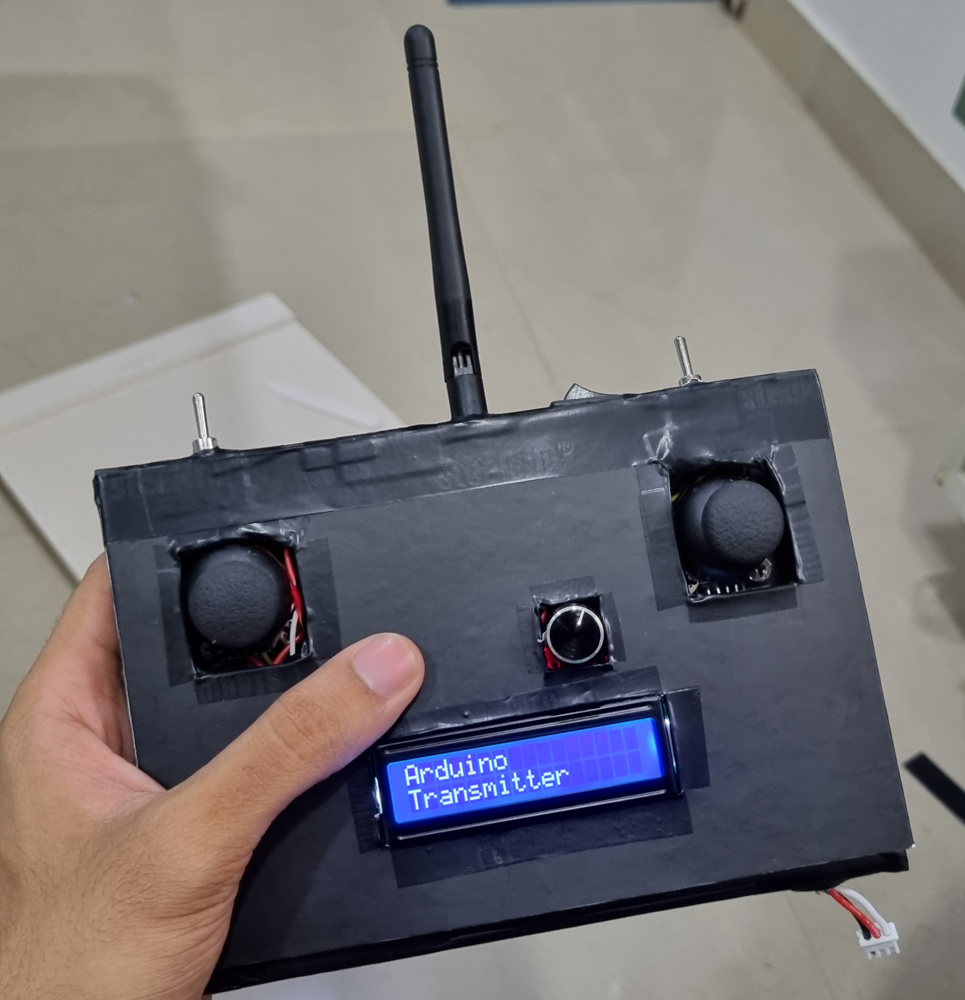

# DIY Radio Controller

A custom-built **Arduino Nano**-based RC transmitter using **NRF24L01+PA+LNA** long-range wireless module, dual joysticks, switches, potentiometer, and a 16x2 LCD for live telemetry.  
Designed for **drones, RC cars, boats, and robotics projects**, with fully open-source code and wiring details.
This Project is Referenced from MAX IMAGINATION. All the circuit diagrams, BOM, etc have been referenced from MAX IMAGINATION yt channel.

---

## Features
- **Arduino Nano** brain with NRF24L01 long-range wireless communication
- **Two analog joysticks** for complete 4-axis control
- **Two SPDT switches** for mode toggles (arming, pairing, etc.)
- **Rotary potentiometer** for proportional control (e.g., camera gimbal or speed control)
- **16x2 I2C LCD** for telemetry & status pages
- Powered by **dual 3.7V LiPo batteries** in series
- Modular, easy-to-edit Arduino code

---

## Repository Structure

---

## Hardware
| Component | Quantity | Notes |
|-----------|----------|-------|
| Arduino Nano | 1 | Main controller board |
| NRF24L01+PA+LNA | 1 | Long range wireless module |
| Joystick module | 2 | VRx + VRy + push button |
| SPDT switch | 2 | Mode selectors |
| Potentiometer (100k) | 1 | Extra analog control |
| 16x2 I2C LCD | 1 | Telemetry display |
| LiPo 3.7V 600mAh | 2 | Series connection |
| Miscellaneous | — | Wires, connectors, casing, soldering tools |

---

## Pin Mapping
| Component | Pin |
|-----------|-----|
| NRF24L01 CE  | D10 |
| NRF24L01 CSN | D9  |
| NRF24L01 SCK | D13 |
| NRF24L01 MOSI| D11 |
| NRF24L01 MISO| D12 |
| Right Joystick VRx | A1 |
| Right Joystick VRy | A2 |
| Right Joystick SW  | D6 |
| Left Joystick VRx  | A3 |
| Left Joystick VRy  | A6 |
| Left Joystick SW   | D7 |
| SPDT Switch 1 | D2, D3 |
| SPDT Switch 2 | D4, D5 |
| Potentiometer | A0 |
| LCD SDA | A4 |
| LCD SCL | A5 |

---

## Wiring Diagram

---

## Gallery
| Build | In Use |
|-------|--------|
|  |  |

---

## Demo Video
[Watch on YouTube](https://youtu.be/your-demo-link)

---

## How to Upload the Code
1. Install **Arduino IDE**
2. Install required libraries:
   - `RF24`
   - `LiquidCrystal_I2C`
3. Connect Arduino Nano via USB
4. Open `src/controller_code.ino`
5. Select **Board** → Arduino Nano, Processor → ATmega328P
6. Upload

---

## Future Improvements
- Add battery voltage sensing
- Integrate with receiver code for multiple vehicle types
- 3D printed custom enclosure
- Telemetry from vehicle (speed, battery, GPS)

---

## License
This project is licensed under the [MIT License](LICENSE).

---

## Disclaimer
This is a DIY project. Always ensure **safe operating practices** when using radio-controlled devices — keep away from crowds and sensitive areas.
